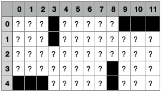
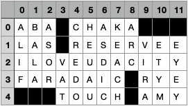

# MCTS Crossword Generator

This package provides a pure Python implementation for generating crosswords using
Monte Carlo Tree Search (MCTS).

A good overview about the project can be found in this 
[blogpost](http://schumacher.pythonanywhere.com/udacity/crossword).




## Quickstart

### Option A - pip package:
1. Create and activate a virtual environment based on Python >= 3.8
2. Install package: `pip install mcts_crossword_creator`
3. In a python shell or your own script:
```
from mcts_crossword_creator import generate_crossword
generate_crossword()
````
### Option B - cloned repository:
1. `git clone` this repository
2. Create and activate a virtual environment based on Python >= 3.8
3. Move into the root directory of the repository 
4. Install requirements: `pip install -r requirements.txt`
5. Run main script: `python mcts_crossword_creator/optimizer.py`

## Examples
crossword --path_to_layout "src/crossword_generator/sample_input/layout_12_5_udacity_empty.csv"
crossword --path_to_layout "src/crossword_generator/sample_input/layout_12_5_udacity_filled.csv"
crossword --path_to_layout "src/crossword_generator/sample_input/layout_12_5_udacity_empty.csv" --path_to_words "src/crossword_generator/sample_input/words_udacity.csv"

Create a 12x5 crossword (shown on top of this page) with words from a CSV file 
- Option A: `generate_crossword(path_to_layout="crossword_input/layout_12_5_udacity_empty.csv", path_to_words="crossword_input/words_udacity.csv")`
- Option B: `python mcts_crossword_creator/optimizer.py --path_to_layout "crossword_input/layout_12_5_udacity_empty.csv" --path_to_words "crossword_input/words_udacity.csv"`

Create a 15x15 American Style crossword based on all English words from NLTK corpus:
- Option A: `generate_crossword(path_to_layout="crossword_input/layout_15_15.csv")` 
- Option B: `python mcts_crossword_creator/optimizer.py --path_to_layout "crossword_input/layout_15_15.csv"`

## Arguments
Here's a list of arguments for `generate_crossword()` you might want to play with:
- *path_to_layout*
    - read an existing grid layout from CSV file
    - the CSV file must have an index column and a header row
    - potential letters are marked with "_" (underscore)
    - black squares are marked with "" (empty)
- *num_rows & num_cols*
    - number of rows / columns a new layout should have
    - will only be considered if path_to_layout is None
- *path_to_words*
    - read words from all CSV files that follow the pattern specified in "path_to_words"
    - the CSV Files must contain a column named "answer" from which the worsd will be read
    - If no path is given, words are read from an English dictionary
- *max_num_words*
    - Limits the number of words to improve runtime
- *max_mcts_iterations*
    - Sets the maximum number of MCTS iterations
    - Can be increased to get a better solution or decreased to improve runtime
- *random_seed*
    - Seed to initialize the random number generator
    - Change this to get different solutions
- *output_path*
    - If provided, save the final grid and a summary of the MCTS to disk

## Modules
- **optimizer.py**
  - script that runs the crossword creator = `generate_crossword()`
- **layout_handler.py**
  - Provides the layout that will later be filled with words
  - `NewLayoutHandler`: creates a new layout from scratch 
  - `ExistingLayoutHandler`: reads an existing layout from a CSV file
- **word_handler.py**
  - Provides the words that will later be filled into the layout
  - `DictionaryWordHandler`: get words from NLTK corpus
  - `FileWordHandler`: read words from CSV files
- **state.py**
  - `Entry`: class that represents the current state of one entry of the crossword
  - `CrosswordState`: class that represents the current state of whole crossword
- **tree_search.py**
  - `TreeNode`: represents one node of the MCTS tree
  - `MCTS`: represents the whole MCTS tree and provides all necessary functionalities such as
    - Selection
    - Expansion
    - Simulation / Rollout
    - Backpropagation

## References
- The MCTS implementation in `tree_search.py` is based on the algorithm provided by [pbsinclair42](https://github.com/pbsinclair42/MCTS),
   which I adapted in several ways:
  - Convert from 2-player to 1-player domain
  - Adjust reward function + exploration term
  - Add additional methods to analyze the game tree
  - Use PEP 8 Code Style

## Dependencies
- Have a look at `pyproject.toml` for a list of all required and optional dependencies
- Python >= 3.8
- Required packages
  - nltk>=3.5
  - pandas>=1.4.0
  - numpy>=1.22.0
  - tqdm>=4.41.0